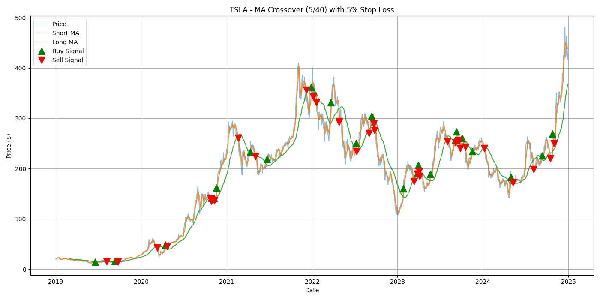
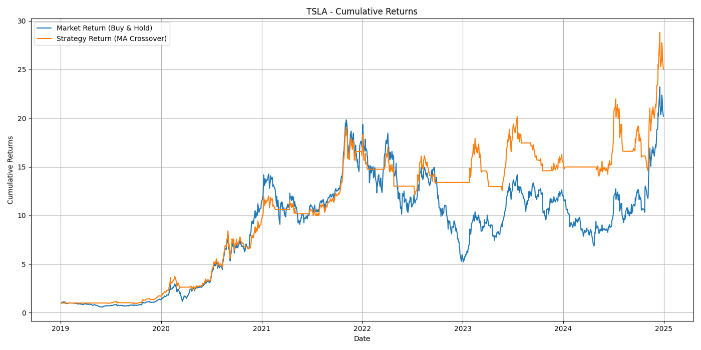
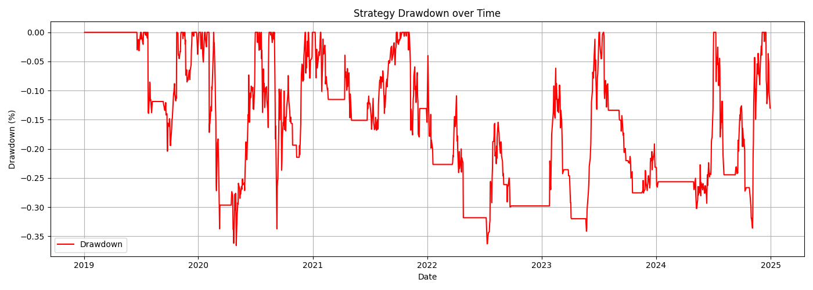
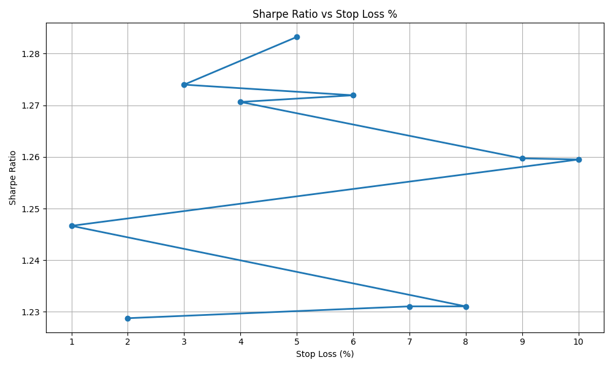
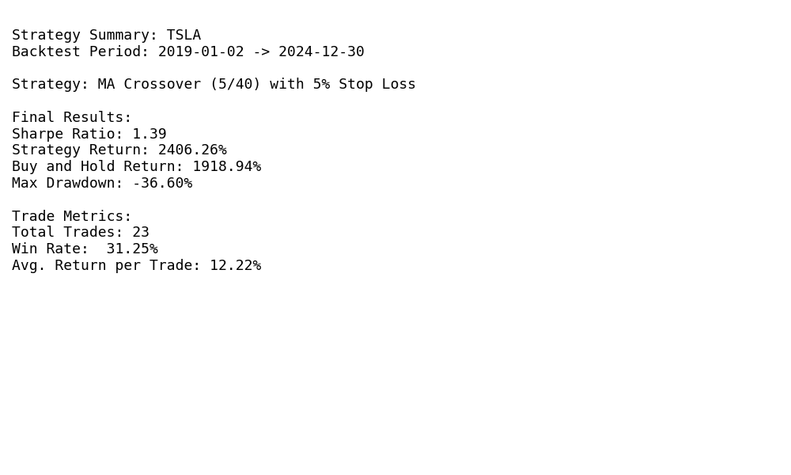

#  Moving Average Crossover Strategy Backtester with Stop-Loss Optimization

###  Created by: [Tarun Kumar Srikumar] [https://github.com/AGTNurat]

---

##  My Motivation

As a computer science student transitioning into Quantitative Finance, this project was an exciting opportunity to bridge both worlds. I wanted to explore how systematic strategies could be programmed, tested, and optimized using Python.

What began as a basic backtester soon evolved into a full system that dynamically finds the best moving averages and stop-loss levels using Sharpe ratio optimization. I used this project to strengthen my understanding of financial metrics, backtesting logic, and performance visualization — and ultimately derive a strategy that outperformed the traditional buy & hold for TSLA.

---

##  Project Overview
This project performs a comprehensive backtest of a selected stock (e.g., `AAPL`, `TSLA`) over a specified historical time period using a **moving average crossover strategy**. It incorporates:

- Strategy signals from short vs long moving averages
- Dynamic stop-loss exit logic
- Optimization of both MA periods and stop-loss % using Sharpe ratio
- Comparison with a buy & hold strategy
- Trade metrics and visualization summaries

All results are output as high-quality visualizations in the `results/` folder for easy inspection.

---

##  Strategy Logic

### Moving Average Crossover
- **Buy Signal**: When the short-term MA crosses **above** the long-term MA
- **Sell Signal**: When the short-term MA crosses **below** the long-term MA
- MAs are computed using a rolling mean over adjustable window sizes

### 🛑 Stop-Loss Logic
- After entering a trade, if price drops more than a user-defined **stop-loss %** (e.g., 2%), the strategy exits early
- Helps avoid large losses during false breakouts or volatile periods

### ⚙️ Optimization
- Performs grid search over the following:
  - Short MA window: 5 to 30 (step 5)
  - Long MA window: 40 to 200 (step 10)
  - Stop-loss %: 1% to 10%
- Objective: **maximize Sharpe Ratio** while maintaining high total return

---

## 📊 Key Highlight: TSLA Strategy Beats Buy & Hold

### TSLA (2019-01-02 to 2024-12-30)
- **Optimized Strategy**: MA Crossover (5/40) with 5% Stop Loss

**Final Results:**
- Sharpe Ratio: **1.39**
- Strategy Return: **2406.26%**
- Buy & Hold Return: **1918.94%**
- Max Drawdown: **-36.6%**

**Trade Metrics:**
- Total Trades: **23**
- Win Rate: **31.25%**
- Avg. Return per Trade: **12.22%**



---

##  Features

- ✅ Full backtest engine for single-ticker stocks
- ✅ Strategy optimization over MA windows and stop-loss thresholds
- ✅ Sharpe Ratio and total return calculation
- ✅ Visualization of:
  - Buy/Sell signals
  - Cumulative strategy vs market returns
  - Drawdown curve
  - Sharpe Ratio vs Stop-Loss %
  - Final metrics summary card
- ✅ Trade metrics (win rate, total trades, avg. return)

---

##  Folder Structure

```
BackTestingProject/
├── main.py                   # Main script to run full backtest & optimization
├── strat.py                  # Contains strategy and stop-loss logic functions
├── results/                  # All output plots
│   ├── final_strategy_graph.png
│   ├── cum_returns.png
│   ├── sharpe_vs_stop_loss.png
│   ├── drawdown_plot.png
│   └── final_summary_card.png
```

---

##  How to Run

1. **Install dependencies**:
```bash
pip install yfinance pandas matplotlib
```

2. **Run the script**:
```bash
python main.py
```

3. **Check output** in the `results/` folder.

---

##  Sample Output Metrics

| Metric              | Value         |
|---------------------|---------------|
| Sharpe Ratio        | 1.39          |
| Strategy Return     | 2406.26%      |
| Buy & Hold Return   | 1918.94%      |
| Max Drawdown        | -36.6%        |
| Total Trades        | 23            |
| Win Rate            | 31.25%        |
| Avg. Return/Trade   | 12.22%        |

---

##  Visual Outputs

### 🔍 Strategy Entry & Exit Points


### 📈 Cumulative Returns (Strategy vs. Market)


### 📉 Max Drawdown Over Time


### 🧪 Stop-Loss Optimization (Sharpe Ratio)


### 🧾 Final Summary Card


---

## ✨ Future Additions (Ideas)
- CSV export of trade logs
- Multi-ticker portfolio backtests
- Integration with TA indicators like RSI, MACD
- GUI or notebook-based interface for parameter tuning

